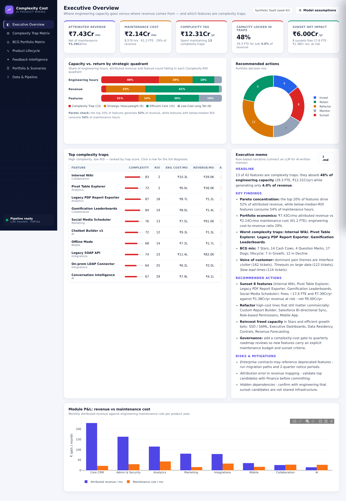
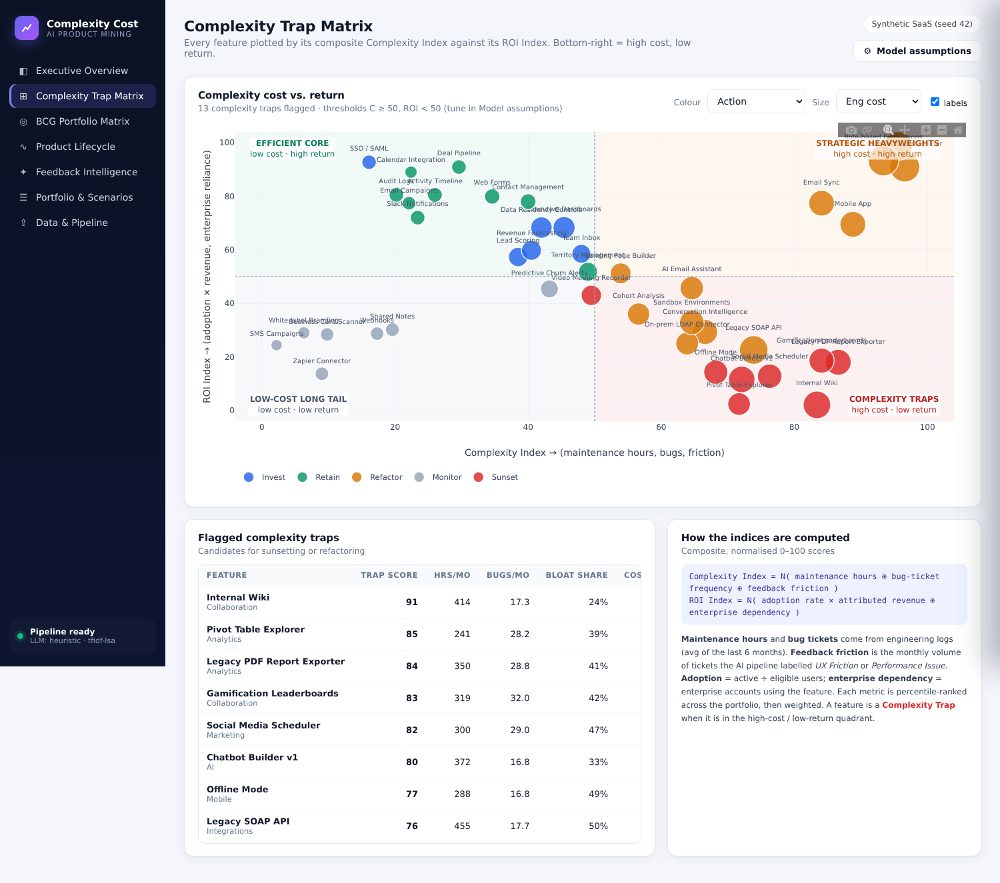
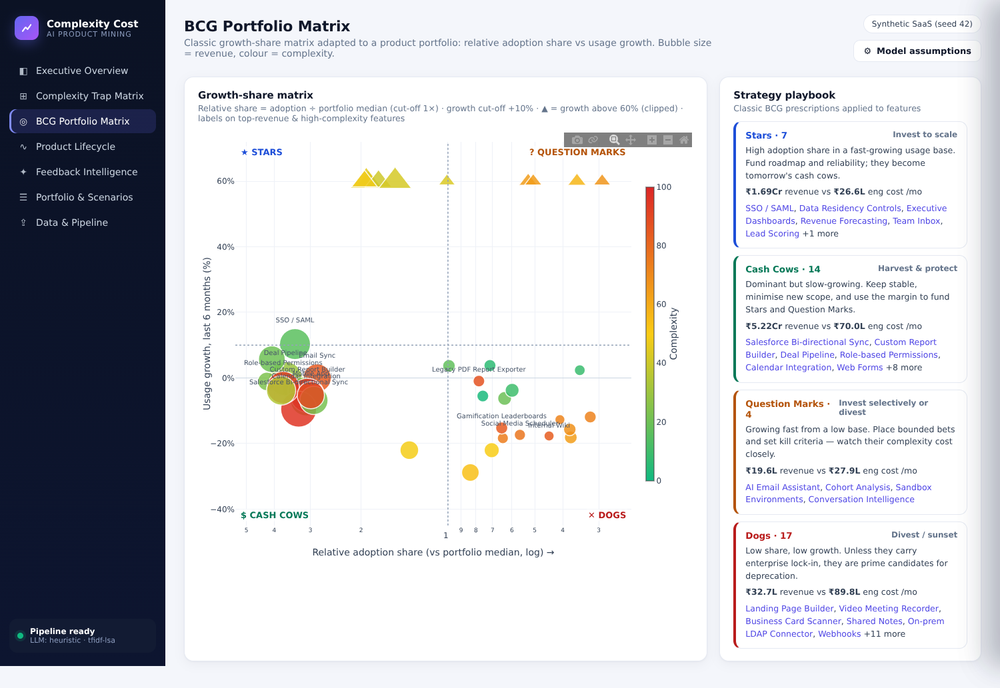
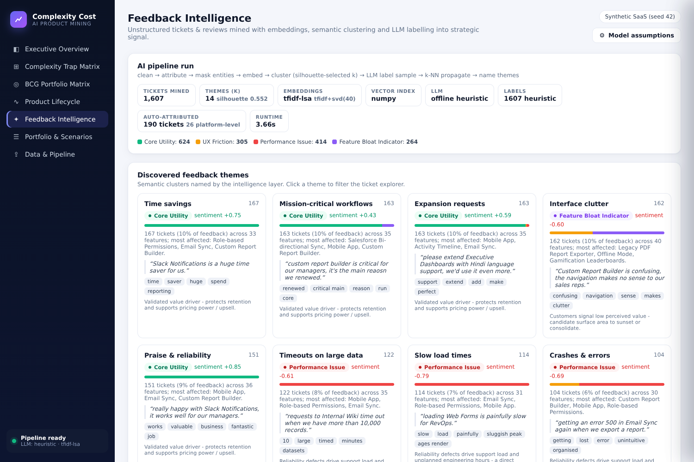
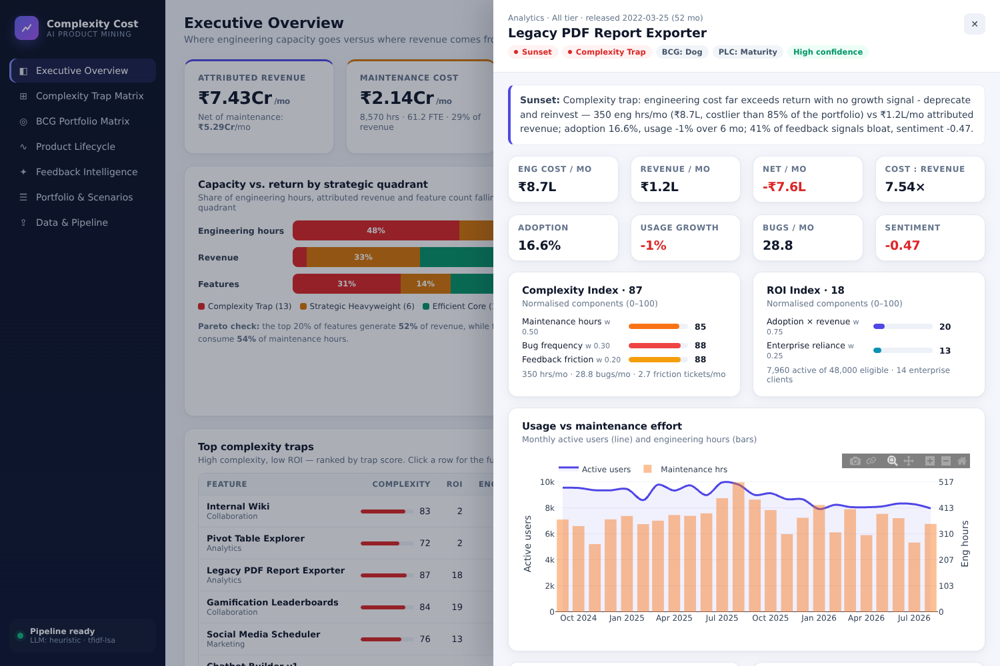

# AI Product Mining & Complexity Cost Dashboard

> Finds the features that use up engineering budget without bringing in revenue.

This tool takes an enterprise's **product catalog, feature usage, engineering logs and unstructured customer feedback**. It groups the feedback by theme using **embeddings, semantic clustering and an LLM**. Then it plots every feature by **maintenance overhead against revenue generated**. Features that cost too much engineering time for what they return are flagged as **Complexity Traps**. The results are shown in standard MBA frameworks: a **Complexity-ROI matrix**, a **BCG growth-share matrix**, the **Product Lifecycle**, and an **executive memo** that recommends *Invest / Retain / Refactor / Monitor / Sunset* for each feature.



It runs **completely offline** with no configuration. When you add a local Ollama model or any OpenAI-compatible API, the LLM layer switches on automatically.

---

## Quick start

```bash
# 1. Local (Python 3.10+)
make install          # creates .venv and installs dependencies
make dev              # http://localhost:8000

# 2. Docker (offline heuristics)
docker compose up --build

# 3. Docker + local LLM (Ollama + Llama 3.1 pulled automatically)
docker compose --profile llm up --build
```

On startup the app creates a realistic synthetic SaaS portfolio and runs the full pipeline, which takes about 4 s. Open **Data & Pipeline** to upload your own CSVs or to generate a new synthetic company.

CLI (no UI):

```bash
python -m app.cli generate --out data/sample --seed 42     # write synthetic CSVs
python -m app.cli analyze  --data data/sample --out reports # full pipeline → CSV/JSON/memo
```

---

## Part 1 — Architecture & data flow

```
[ Raw enterprise data ]                      CSV upload · API · synthetic generator
  ├─ features.csv          product catalog / DB export
  ├─ usage_monthly.csv     product analytics (MAU per feature)
  ├─ engineering_logs.csv  Jira time-spent, bug tickets, GitHub commits
  └─ feedback.csv          Zendesk / Jira SD / G2 / NPS free text
          │
          ▼
[ Backend engine — Python · FastAPI · pandas · scikit-learn ]
  1. Ingestion & validation     schema aliases, flat-or-full layouts, warnings           app/ingest.py
  2. Feedback mining            clean → attribute → mask → embed → cluster → LLM label  app/mining.py
                                → k-NN propagate → LLM-named themes                      app/nlp/*
  3. Complexity-vs-return       normalised indices, trap flag, BCG, PLC, actions         app/engine.py
  4. Narrative                  LLM-written or rule-based executive memo                 app/memo.py
          │   REST/JSON (/docs for OpenAPI)
          ▼
[ Dashboard — vanilla JS + Plotly (served offline from the Python package) ]
  Executive Overview · Complexity Trap Matrix · BCG Matrix · Product Lifecycle ·
  Feedback Intelligence · Portfolio & Sunset Scenarios · Data & Pipeline
```

| Layer | Tech | Degrades gracefully to |
|---|---|---|
| Embeddings | `sentence-transformers` (all-MiniLM-L6-v2) | TF-IDF → TruncatedSVD (LSA) |
| Vector index | FAISS `IndexFlatIP` | NumPy cosine search |
| LLM | Ollama (Llama 3.1) or any OpenAI-compatible API | Lexicon rules + templates |
| Clustering | KMeans, k chosen by silhouette sweep | — |
| UI charts | Plotly.js | — |

Install the optional ML extras with `pip install -r requirements-ml.txt`, or with `INSTALL_ML=true docker compose build`.

---

## Part 2 — Modules

### Module 1 · Synthetic enterprise dataset (`app/synthetic.py`)
This module generates a fictional B2B CRM ("Nimbus") with **42 features across 8 modules, 24 months of usage and engineering logs, and about 1,600 messy tickets**. The tickets include greetings, sign-offs, typos, lowercase text and 12% with no feature tag. Every feature is secretly given a strategic **archetype**: star, cash cow, heavyweight, question mark, trap, niche or declining. The archetype controls its adoption curve, cost profile and feedback mix. Archetypes are **not written to the CSVs**, so the pipeline has to work them out from raw signals. The test suite checks that it does.

| Field (blueprint) | Column |
|---|---|
| feature_id, feature_name, release_date | `features.csv` |
| development_cost_inr | `features.development_cost_inr` |
| monthly_maintenance_hours | `engineering_logs.maintenance_hours` (monthly) |
| customer_feedback_text | `feedback.text` |
| direct_revenue_attributed | `features.monthly_revenue_inr` |
| tier_dependency | `features.enterprise_clients` |

### Module 2 · LLM-powered feedback clustering (`app/mining.py`, `app/nlp/`)
1. **Clean** boilerplate such as greetings and sign-offs.
2. **Attribute** untagged tickets to a feature, first by name mention and then by token overlap. On synthetic data this is correct about 88% of the time.
3. **Mask entity names** ("Email Sync" → "this feature") so clusters group by *theme* rather than by product noun.
4. **Embed** the text, blending in a small SaaS-theme seed lexicon. This is guided topic modelling, similar to seeded BERTopic, and its weight is set by `THEME_SEED_WEIGHT`.
5. **Cluster** with KMeans. `k` is picked with a silhouette sweep, taking the smallest k within 0.02 of the best score.
6. **LLM labelling with structured JSON.** A cluster-stratified sample of up to `LLM_TICKET_BUDGET` tickets is sent in batches. Each ticket is classified as **Core Utility / UX Friction / Performance Issue / Feature Bloat Indicator**, with a sentiment score and a short summary. The remaining tickets are labelled by **k-NN label propagation** in embedding space. This keeps cost and latency flat as ticket volume grows.
7. The **LLM names each cluster** and writes a summary and business impact from its keywords (c-TF-IDF) and representative quotes.
8. Every LLM response is validated. Anything malformed falls back to the rule-based result for that item, so the pipeline never fails because of the LLM.

On the synthetic data the offline path reaches **about 97% category accuracy** and **ARI of about 0.87** against the hidden ground-truth themes.

### Module 3 · Complexity Cost vs. Return engine (`app/engine.py`)

```
Complexity Index = w₁·N(maintenance hours) + w₂·N(bug-ticket frequency) + w₃·N(feedback friction)
ROI Index        = w₄·N(adoption rate × attributed revenue) + w₅·N(enterprise dependency)
Complexity Trap  ⇔ Complexity ≥ τc  and  ROI < τr
```

* `N` means percentile rank (the default, robust to outliers) or min-max on a log scale.
* *Feedback friction* is the monthly count of AI-labelled UX and performance complaints. This is how the unstructured text feeds into the cost model.
* All weights and thresholds, plus the loaded ₹/hour cost, the lookback window and the BCG cut-offs, are **live sliders** in the UI under *Model assumptions*.

It also computes monthly engineering cost, net contribution, the cost-to-revenue ratio, development-cost payback, the portfolio **"complexity tax"** (annual spend on traps), the FTEs tied up in traps, and a Pareto check.

### Module 4 · Executive dashboard & MBA frameworks

| Framework | How it is operationalised |
|---|---|
| **Complexity-ROI matrix** | Efficient Core · Strategic Heavyweights · Low-Cost Long Tail · **Complexity Traps** |
| **BCG matrix** | *Relative share* = adoption ÷ portfolio-median adoption (cut-off 1.0×, classic BCG); *growth* = usage growth over the lookback window (cut-off 10%) → Star / Cash Cow / Question Mark / Dog |
| **Product Lifecycle** | Introduction (under 6 months, or young and growing) · Growth (≥ growth cut-off) · Decline (≤ −8%, or below 80% of peak and falling) · Maturity |
| **Recommendation** | Trap → **Sunset**. The exceptions are traps early in the lifecycle (**Refactor**: re-scope before scaling) and traps with **enterprise lock-in** (**Refactor**: migrate dependents first). Heavyweights → Invest if Star, otherwise Refactor. Efficient Core → Invest if growing, otherwise Retain (harvest). Long tail → Monitor, or Sunset if declining and customers call it bloat. Each recommendation includes a quantified rationale and a confidence level based on distance from the thresholds. |
| **Scenario planner** | Select features to sunset and see engineering cost avoided, revenue at risk (with a migration-retention slider), FTE freed and net annual impact. |

| Complexity Trap Matrix | BCG Matrix |
|---|---|
|  |  |
| **Feedback Intelligence** | **Feature diagnosis drawer** |
|  |  |

---

## Bring your own data

Only `features.csv` is required. Download templates from **Data & Pipeline** or use `data/sample/`.

| File | Required columns | Optional |
|---|---|---|
| `features.csv` | `feature_id, feature_name` | `module, tier, description, release_date, development_cost_inr, monthly_revenue_inr, enterprise_clients, eligible_users` |
| `usage_monthly.csv` | `feature_id, month, active_users` | |
| `engineering_logs.csv` | `feature_id, month, maintenance_hours` | `bug_tickets, commits, incidents` |
| `feedback.csv` | `text` | `ticket_id, feature_id, source, created_at, customer_tier` |

**Flat mode:** you can skip the usage and engineering files by putting `active_users`, `monthly_maintenance_hours` and `bug_tickets_per_month` directly on `features.csv`. Common aliases such as `direct_revenue_attributed`, `tier_dependency`, `mau` and `customer_feedback_text` are mapped automatically, and currency strings like `₹1,00,000` are parsed.

## Configuration

See [`.env.example`](.env.example). The key settings:

| Variable | Default | Meaning |
|---|---|---|
| `LLM_PROVIDER` | `auto` | `auto` tries Ollama, then OpenAI, then heuristic. You can also force `ollama`, `openai` or `heuristic`. |
| `OLLAMA_HOST` / `OLLAMA_MODEL` | `http://localhost:11434` / `llama3.1` | Local LLM |
| `OPENAI_API_KEY` / `OPENAI_BASE_URL` / `OPENAI_MODEL` | – | Any OpenAI-compatible endpoint (OpenAI, Groq, Together, vLLM, LM Studio) |
| `LLM_TICKET_BUDGET` | `240` | Tickets labelled directly by the LLM; the rest are propagated |
| `EMBEDDING_BACKEND` | `auto` | `sentence-transformers` if installed, otherwise `tfidf` |
| `DATA_SOURCE` | `synthetic` | `synthetic`, `sample`, or a folder path containing CSVs |

## API

OpenAPI docs are at `/docs`. The main endpoints:
`GET /api/analysis?<params>` · `GET /api/features/{id}` · `GET /api/memo` · `GET /api/feedback/clusters|map|tickets|heatmap` · `POST /api/datasets/upload` · `POST /api/datasets/synthetic` · `GET /api/export/features.csv|tickets.csv|memo.md`

## Tests

```bash
make test   # 28 tests: ingestion, generator determinism, NLP quality, engine logic, LLM client (mocked Ollama), API
```

The tests check that the pipeline **recovers the hidden archetypes**. At least 80% of trap-archetype features must be flagged, no cash cow may be flagged, stars must get *Invest*, and a lock-in trap must get *Refactor* rather than *Sunset*. The LLM path is tested end to end against a mocked Ollama server, including malformed and fenced JSON responses.

---

## Part 3 — How to pitch it (MBA)

> *"Companies often suffer from feature bloat because engineering teams build what is technically interesting, while finance teams only look at macro P&L statements. I built this tool to bridge that gap. It uses semantic embeddings to mine unstructured customer feedback and quantitative cost metrics to expose 'complexity traps' that bleed engineering budget without driving enterprise ROI."*

* **Marketing Management:** BCG portfolio matrix, product lifecycle staging, voice-of-customer analytics.
* **Strategic Management:** resource allocation, strategic cost analysis (the "complexity tax"), divest and harvest decisions, and enterprise lock-in as a switching-cost constraint.
* **Talking point from the demo data:** 13 of 42 features absorb **48% of engineering capacity (about 29 FTE, ₹12.3 Cr/yr)** while generating **4% of revenue**. Sunsetting 8 of them frees about 18 FTE, for a net gain of about ₹6 Cr/yr.

## Project layout

```
app/
  main.py        FastAPI routes + static UI       engine.py   indices, trap flag, BCG, PLC, actions
  pipeline.py    background run + caching         mining.py   feedback mining orchestration
  ingest.py      schema normalisation             memo.py     executive memo
  synthetic.py   dataset generator                cli.py      generate / analyze / serve
  nlp/           embeddings · clustering · classify (offline) · llm (Ollama/OpenAI) · text
web/             index.html · css/app.css · js/{app,views,charts,ui}.js
data/sample/     generated sample CSVs (templates)
tests/           pytest suite
```
